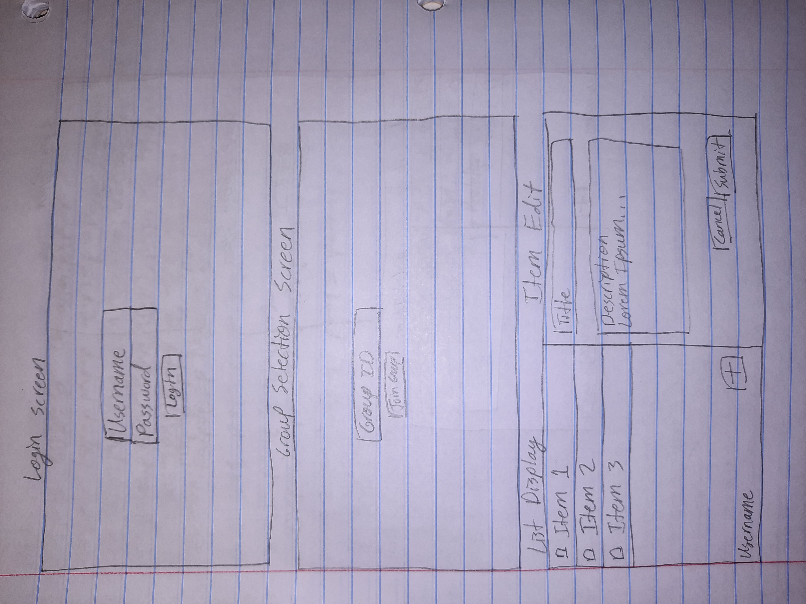
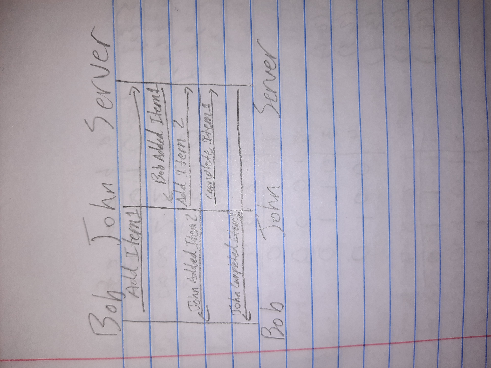

# Your startup name here

[My Notes](notes.md)

This is a collaborative to-do list. Users will be able to add items to the list, and check-off items when they are completed. The list will be updated in real time for all members of the team.

> [!NOTE]
>  This is a template for your startup application. You must modify this `README.md` file for each phase of your development. You only need to fill in the section for each deliverable when that deliverable is submitted in Canvas. Without completing the section for a deliverable, the TAs will not know what to look for when grading your submission. Feel free to add additional information to each deliverable description, but make sure you at least have the list of rubric items and a description of what you did for each item.

> [!NOTE]
>  If you are not familiar with Markdown then you should review the [documentation](https://docs.github.com/en/get-started/writing-on-github/getting-started-with-writing-and-formatting-on-github/basic-writing-and-formatting-syntax) before continuing.

## 🚀 Specification Deliverable

> [!NOTE]
>  Fill in this sections as the submission artifact for this deliverable. You can refer to this [example](https://github.com/webprogramming260/startup-example/blob/main/README.md) for inspiration.

For this deliverable I did the following. I checked the box `[x]` and added a description for things I completed.

- [x] Proper use of Markdown
- [x] A concise and compelling elevator pitch
- [x] Description of key features
- [x] Description of how you will use each technology
- [x] One or more rough sketches of your application. Images must be embedded in this file using Markdown image references.

### Elevator pitch

Have you ever had a hard time keeping track of who was doing what in a group project? Or has your team at work had a hard time keeping track of tasks? What you need is a way to easily share a to-do list between group members. OneList allows your group to have a shared to-do list so that everyone knows what still needs to be done, and everyone can celebrate when someone completes a task. OneList provides real-time collaborative editing on a single group to-do list, allowing you and your group members to spend less time coordinating your work and more time actually working.

### Design

#### Page Design

#### Client-Server Interaction Diagram

### Key features

- Secure login over HTTPS
- Ability to add a to-do item
- Ability to check off a to-do item
- Changes to list are shown in real time to all team members
- List is persistently stored between login sessions

### Technologies

I am going to use the required technologies in the following ways.

- **HTML** - Uses correct HTML structure with four pages, one for login, one for group selection, one for showing the list and one for editing/adding items.
- **CSS** - Application styling that works on different screen sizes and looks nice.
- **React** - Used for login and for editing, adding and removing items.
- **Service** - Backend service with endpoints for  
    - login
    - retrieving the list
    - updating the list
    - third-party endpoint to generate lorem ipsum filler for item templates.
- **DB/Login** - Store users, teams and to-do lists. Securely store login credentials.
- **WebSocket** - When a team member updates the list the updates are shown to all team members.

## 🚀 AWS deliverable

For this deliverable I did the following. I checked the box `[x]` and added a description for things I completed.

- [x] **Server deployed and accessible with custom domain name** - [My server link](https://tchrt.click).

## 🚀 HTML deliverable

For this deliverable I did the following. I checked the box `[x]` and added a description for things I completed.

- [x] **HTML pages** - Four pages. `index.html` for the login page, `group.html` for group selection, `list.html` to show the shared to-do list and `item.html` for adding and editing items.
- [x] **Proper HTML element usage** - I used several different elements. Each page has a head and a body. The head contains a nav element with an unordered list of navigation links, and the body has a header element, a main element, and a footer element. I also used div, span, input, form, etc.
- [x] **Links** - Each page has links to every other page.
- [x] **Text** - Each page has headers that explain what to do on that page. Forms also have placeholder text to clarify the purpose of inputs.
- [x] **3rd party API placeholder** - The item edit screen will have lorem ipsum text generated in the textbox for the item description as placeholder text.
- [x] **Images** - The login and group selection pages each have an image (the checklist logo).
- [x] **Login placeholder** - Placeholder for authentication on the Login page.
- [x] **DB data placeholder** - Group to-do lists will be stored in a database. The list page will pull data from the database.
- [x] **WebSocket placeholder** - The list page will be updated for all users whenever someone edits the list.

## 🚀 CSS deliverable

For this deliverable I did the following. I checked the box `[x]` and added a description for things I completed.

- [x] **Header, footer, and main content body** - The header, footer and main sections are all styled nicely with good background colors and nice layout of child elements.
- [x] **Navigation elements** - The navigation bar is nicely laid out with links to each page.
- [x] **Responsive to window resizing** - Everything in the application scales nicely at different window sizes. This was because of Bootstrap, display:flex and @media sections.
- [x] **Application elements** - All necessary parts of the application were added. I had to use a few different `display` options to get different elements to line up correctly, including flex, inline and block.
- [x] **Application text content** - I used the default text styling from Bootstrap, which I think looks nice.
- [x] **Application images** - I moved the logo image to the navigation bar.

## 🚀 React part 1: Routing deliverable

For this deliverable I did the following. I checked the box `[x]` and added a description for things I completed.

- [x] **Bundled using Vite** - I set up an NPM package and installed Vite to package and build my startup.
- [x] **Components** - I made a component for each HTML page from the previous phases.
- [x] **Router** - I set up routing between each component so that the navigation looks the same to the user as in previous phases, but using React this time.

## 🚀 React part 2: Reactivity

For this deliverable I did the following. I checked the box `[x]` and added a description for things I completed.

- [x] **All functionality implemented or mocked out** - Mostly mocked out with localStorage. Websocket imitated with setInterval and useEffect. The filler text on the item edit page will be provided by a third-party service.
- [x] **Hooks** - Used useEffect to simulate Websocket and useState to render changed state in the list.

## 🚀 Service deliverable

For this deliverable I did the following. I checked the box `[x]` and added a description for things I completed.

- [x] **Node.js/Express HTTP service** - I installed express and set up a server to listen on port 4000.
- [x] **Static middleware for frontend** - I set up express to send static files from the public directory.
- [x] **Calls to third party endpoints** - Call to cs260 quote api for filler text when creating an item (item.jsx);
- [x] **Backend service endpoints** - Simple endpoints for authentication, group selection, and list manipulation.
- [x] **Frontend calls service endpoints** - Frontend calls backend instead of mocking functionality. Fully supports authentication and restricts access to data if not logged in.

## 🚀 DB/Login deliverable

For this deliverable I did the following. I checked the box `[x]` and added a description for things I completed.

- [ ] **User registration** - I did not complete this part of the deliverable.
- [ ] **User login and logout** - I did not complete this part of the deliverable.
- [ ] **Stores data in MongoDB** - I did not complete this part of the deliverable.
- [ ] **Stores credentials in MongoDB** - I did not complete this part of the deliverable.
- [ ] **Restricts functionality based on authentication** - I did not complete this part of the deliverable.

## 🚀 WebSocket deliverable

For this deliverable I did the following. I checked the box `[x]` and added a description for things I completed.

- [ ] **Backend listens for WebSocket connection** - I did not complete this part of the deliverable.
- [ ] **Frontend makes WebSocket connection** - I did not complete this part of the deliverable.
- [ ] **Data sent over WebSocket connection** - I did not complete this part of the deliverable.
- [ ] **WebSocket data displayed** - I did not complete this part of the deliverable.
- [ ] **Application is fully functional** - I did not complete this part of the deliverable.
